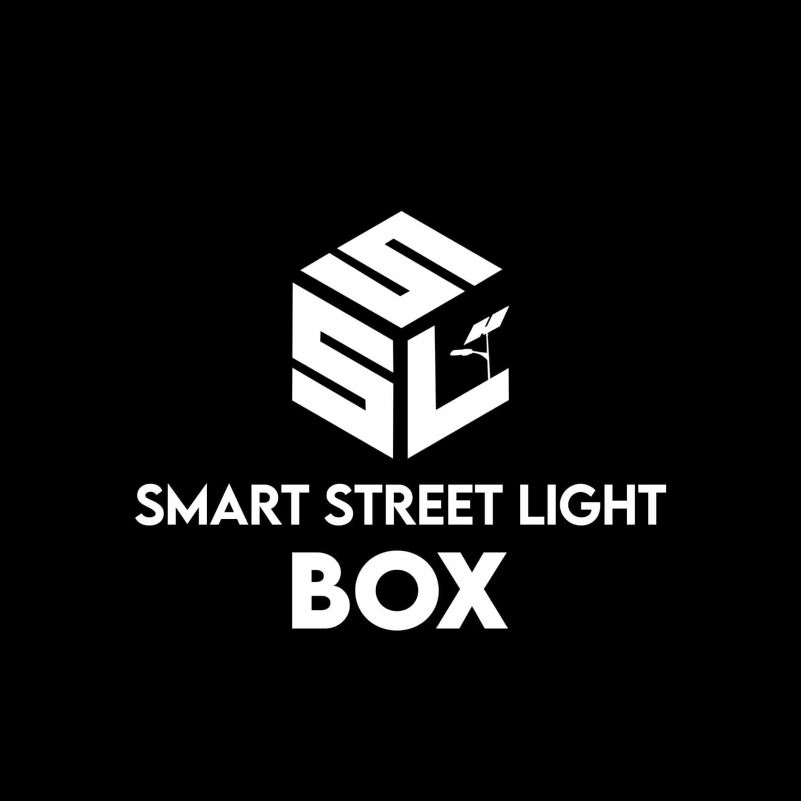
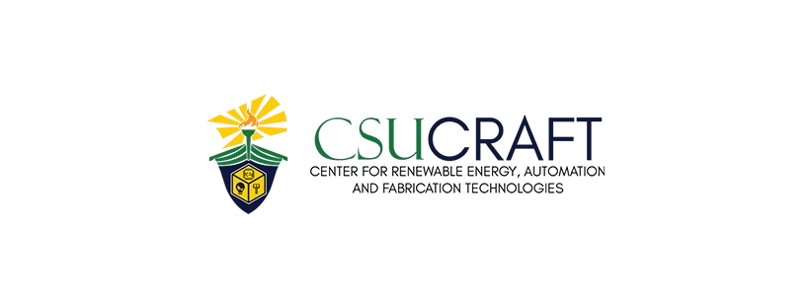

## About SSLSIRLICS

Smart Street Light System which is under the research "RS-Program on Producing Alternative Clean Energy and Power in Partnership of Caraga LGU's | CSU CRAFT

    

### SOCID format

`{PROVINCE}-{MUNICIPALITY/CITY}-{BARANGAY}-{STREETLIGHT_NUMBER}

### Instructions

`composer install`

`npm install -D vite`

`cp .env.example .env`

`php artisan key:generate`

`php artisan migration`
